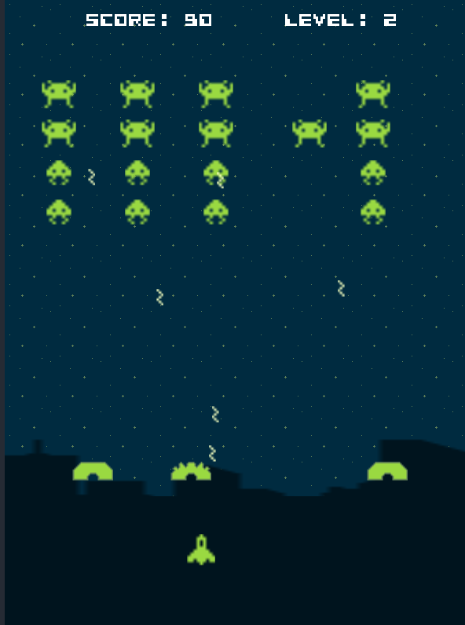

# Godot Invaders

A copy of Space Invaders ([Wikipedia](https://en.wikipedia.org/wiki/Space_Invaders)), the
original shoot'em up from 1978, created in Godot 4.5.

  

## Key Features

This game, as a practice, is not a proper copy of the original space invader but an
overly simplified one:

- Player can move left and right and shoot rockets at aliens
- Buildings protect, up to a certain level of damages, the city and the Player
- Ennemies, aliens, spawn, move left and right before approaching the city and
  bombard the city and the Player with their own missiles.

  There are only two levels only displays two patterns of ennemies

## Key Learnings

TL;DR learnings:

- **Player, Ennemies and Bullets**:
  - Choosing between `CharacterBody2D`, `RigidBody2D` and `Area2D`
  - Collision Management
- **Visual Management**:
  - SpriteFrame usage within `Sprite2D` or `AnimatedSprite2D`
- **Abstractions**:
  - Inherited Scenes
  - Signal forwarding from children scene to parent scene

### Player, Ennemies and Bullets

#### Choosing between `CharacterBody2D`, `RigidBody2D` and `Area2D`

Four game elements needed 2D representation:

- The Player's spaceship
- Ennemies
- Player's bullets and ennemies' bullets
- Building

Although physics are not involved in Godot Invader, I wanted to pick the right node
as-if some physics were involved, such as a platform game.

The `CharacterBody2D` official documentation ([link](https://docs.godotengine.org/en/stable/classes/class_characterbody2d.html)) explicitly
mentions it is meant for user-controlled elements so it was an obvious pick for 
the Player's spaceship. This was confirmed by the [Using CharacterBody2D/3D](https://docs.godotengine.org/en/stable/tutorials/physics/using_character_body_2d.html) manual.

For the ennemies, I was hesitating at using `RigidBody2D` as first as the 
[documentation](https://docs.godotengine.org/en/stable/classes/class_rigidbody2d.html) as 
well as the [Using RigidBody](https://docs.godotengine.org/en/stable/tutorials/physics/rigid_body.html#) 
manual mentions that it is not directly controlled but should rather have forced applied.
The canonical examples are blocks from Angry Birds that explodes. 

While I picked `RigidBody2D` in this example, seeing such [discussion](https://forum.godotengine.org/t/unsure-of-i-should-use-a-characterbody2d-or-a-rigidbody2d/79226) will make me pick `CharacterBody2D` 
for ennemies in another game, especially if the script matters more than the physics.

As for bullets and buildings, they are neither depending on physics nor script so a simple `Area2D`
did the work for me. Also, `StaticBody2D` was not picked because the collision was what mattered
more. Also the different tutorials used `Area2D` for bullets. Building, however, could have been
`StaticBody2D`.

#### Collision Management

> [!NOTE]
> Never forget your CollisionShape2D and how they should interact!

Missiles are the only interactions at the moment. There is no game over when the aliens
cross the building or reach the player's level.

- `Area2D` (Buildings):
  
  It was easier to treat collision from `Area2D` as the behaviour could
  have changed depending on what entered. Also, the [coin](https://docs.godotengine.org/en/stable/tutorials/physics/using_area_2d.html#overlap-detection) example also triggered the collision from the coin
  and fired the necessary signals to update game.

- `RigidBody2D` (Ennemies)

  `Area2D` react to `RigidBody2D` so a bullet can simply listen to the 
  `_on_body_entered(body: Node2D)` signal.

- `CharacterBody2D` (Player)

  `CharacterBody2D` do not track collisions with other `Area2D` so an `Area2D` 
  and a `CollisionShape2D` must be added.
  

### Visual Management

Thanks for the [2D sprite animation](https://docs.godotengine.org/en/stable/tutorials/2d/2d_sprite_animation.html) manual and 
this [Importing Sprites into Godot](https://www.spritecook.ai/godot-sprites) tutorial, I could leverage the free
game assets for the visuals.

However, for the buildings that have different frames depending on its health, Copilot
helped me on this. Copilot basically proposed three options:

- Using a single `Sprite2D` and manually change the texture on health change
- Using an `AnimatedSprite2D` and play the right animation. 
- Using an `AnimationPlayer`

Buildings having static images, the other two options were a bit overkill so
I went for the manual atlas texture change method.

### Abstractions

#### Inherited Scenes

Like any object-oriented language, I wanted to see how scene inheritance works:

- Defining scene nodes in parent scene but children can override its value. 

  For example, Crab and Octopus can resize the CollisionShape from the parent
  BaseEnnemy. But they can also augment its parent's nodes by adding more nodes.

- Proper GD Script inheritance with override or `super` calling

This [Inheritance in Godot 4](https://www.gotut.net/inheritance-in-godot-4/) tutorial
helped me defininig the [base=ennemy](./ennemies/base_ennemy.tscn) scene.

The official [Inheritance](https://docs.godotengine.org/en/stable/tutorials/scripting/gdscript/gdscript_basics.html#inheritance)
GD Script was a bit light in that regard.

#### Signal forwarding from children scene to parent scene

Copilot also helped me here as well. When an ennemy dies, its signal is caught by the `Game` scene
but it needs to forward to the `Main` scene to update the score. Copilot proposed three options:

1. `Game` re-emits the signal from `BaseEnnemy` to `Main`
2. `Game`, when instantiating an ennemy, directly connects the `dead` event to `Main`
3. `Game` notifies an Event Bus

The Event Bus, while powerful, was a bit overkill for this use-case so it was worth checking
and I believe it is a more scalable and cleaner solution so more complex game.

For the second option, I am personally inclined for loose coupling so the direct coupling 
from option#2 was a "No" for me due to personal preference.

The remaining is Option#1. While it sounds laborious, a re-emit made sense to me. `Game` does
not have to forward the `dead` signal as it is. For example in [game.gd](./game.gd), `Game`
catches an ennemy's `dead` signal but transforms it into a `score_update` signal. The 
`score_update` could then have been triggered by another event. For example, a destroyed 
building could have decreased the score.

## Assets

This game could be achieved thanks to the following assets:

- Visual Assets: https://comp3interactive.itch.io/invaders-from-outerspace-full-project-asset-pack
- Font: https://www.fontspace.com/cosmic-alien-font-f3323

## References

### Space Invader like implementation

- https://forum.godotengine.org/t/space-invaders-for-everyone/104146: a single-block code to generate
  a space invader like game. I have not tested it personally.
- https://github.com/Hernandez712/SpaceInvaders-Godot: another Space Invader copy that I used as
  reference

### Godot Techniques

**Sprite Management**
- https://www.spritecook.ai/godot-sprites: How to use sprite frames in Godot

**2D Bodies**:
- https://uhiyama-lab.com/en/notes/godot/physics-body-comparison/: explanation of the
  differences between `RigidBody2D` and `CharacterBody2D`
- https://forum.godotengine.org/t/should-projectiles-be-area2d-or-rigidbody2d/44418:
  Forum discusssion regarding using `Area2D` or `RigidBullet2D` for bullets

**Ennemies and Bullets**
- https://kidscancode.org/godot_recipes/4.x/2d/2d_shooting/: a tutorial to spawn bullets
  that evolves independently from Player's position and direction
- https://medium.com/@filipbs/godot-make-enemy-fire-a-bullet-at-the-player-or-any-target-in-2d-645553868dcf:
  tutorial to make ennemies firing bullets

**GD Script coding**:
- https://www.gotut.net/inheritance-in-godot-4/: How to define scene abstraction thanks to scene
  inheritance
- https://www.gdquest.com/tutorial/godot/design-patterns/entity-component-pattern/: Entity-Component
  design pattern for code re-usability and flexibility. I ended up not using it as it looks like the 
  hitbox/hurtbox that is overkill for the current game.
- https://www.gdquest.com/library/hitbox_hurtbox_godot4/: weapon and target model
- https://www.gdquest.com/tutorial/godot/design-patterns/event-bus-singleton/: event bus tutorial
- https://dev.to/bajathefrog/riding-the-event-bus-in-godot-ped: another explanation of event bus